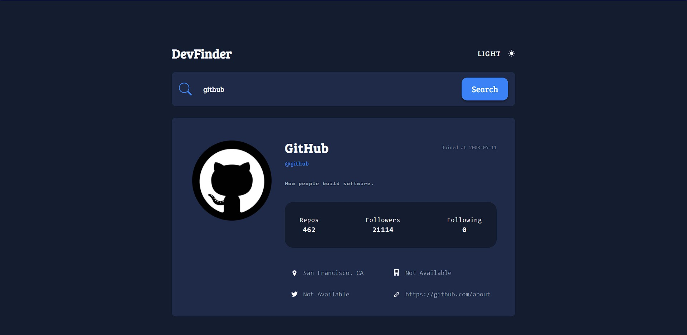
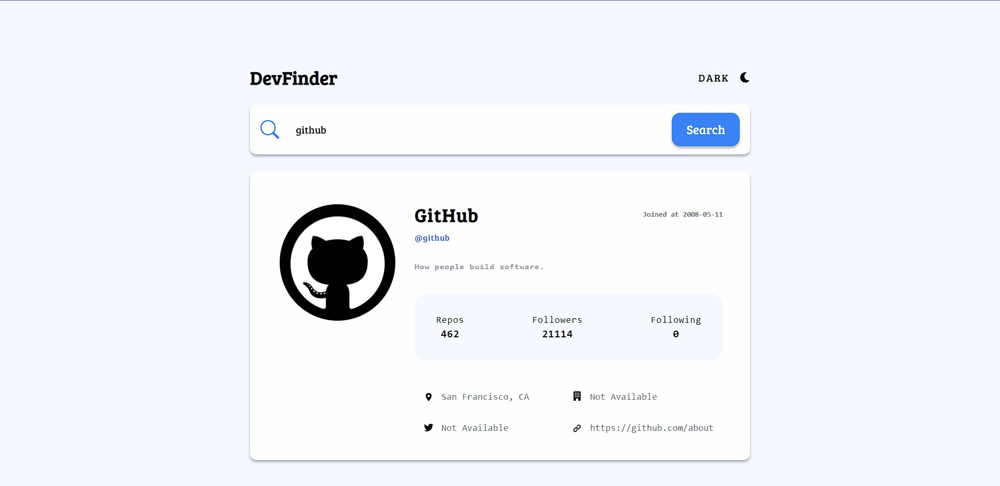

# GitHub user search app
* Dark Mode

* Light Mode

## Introduction 👋
  GitHub usersearch app is built using ViteJS (for creating a react project and tailwind configs), ReactJS,Tailwind CSS. Additionally, NodeJs and Express is used for backend services such as API services(using Axios in this project). The result is a dynamic and functional search app (Website) that searches users using github api.
## Tech stack 🛠️
  * [viteJS](https://vitejs.dev)
  * [ReactJS](https://react.dev)
  * [Tailwind CSS](https://tailwindcss.com/)
  * [NodeJS](https://nodejs.org/en)
  * [ExpressJS](https://expressjs.com)
  * [Axios](https://axios-http.com)
